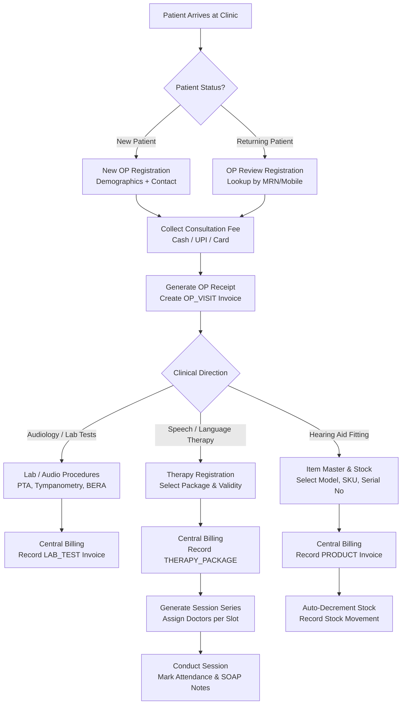

# HIS LITE (MediOne) — Comprehensive System Logic, Workflow, RBAC & Gap Analysis

**Target System:** HIS LITE / MediOne (Speech, Hearing, & ENT Specialised Hospital Information System)  
**Architecture:** Modular Monolith (NestJS API + React Vite SPA + PostgreSQL / Prisma + Redis BullMQ)  
**Tenant Model:** Multi-tenant SaaS with isolated clinic data and centralized platform administration  

---

## 1. System Architecture & Core Logics

### 1.1 Multi-Tenancy & Data Isolation Logic
* **Tenant Isolation:** Every operational table (`patients`, `invoices`, `therapy_cases`, `products`, `users`, etc.) contains a foreign key `clinicId`.
* **Database-Level Protection:** Multi-tenancy is reinforced at the Prisma repository layer where `clinicId` is injected from the authenticated JWT session (`req.user.clinicId`).
* **SaaS Subscription Gating:**
  * Access is gated via `SubscriptionGuard`.
  * States: `ACTIVE`, `TRIALING`, `GRACE_PERIOD`, `PAST_DUE`, `CANCELED`, `EXPIRED`.
  * In `GRACE_PERIOD` or `EXPIRED`, write operations are blocked while historical clinical and financial data remain read-only to prevent clinic data hostage scenarios.
  * Platform Super Admin operates outside standard clinic constraints (`/platform`) with dedicated bypass capabilities.

### 1.2 Central Financial & Billing Engine Logic
* **Single Cashier Rule:** No operational module (Inventory, Lab, Therapy, Reception) maintains its own separate billing database. Everything funnels through the central billing engine:
  $$\text{BillableItem} \longrightarrow \text{Invoice} \longrightarrow \text{Payment} \longrightarrow \text{Receipt / Tax Invoice}$$
* **Billable Types:**
  * `OP_VISIT`: Consultation fees collected at front desk registration.
  * `THERAPY_PACKAGE` & `THERAPY_SESSION`: Session blocks or individual therapy appointments.
  * `LAB_TEST`: Diagnostic audiology and ENT procedures (PTA, Tympanometry, BERA, OAE).
  * `PRODUCT`: Hearing aids, batteries, ear moulds, accessories (triggers stock deduction).
  * `OTHER`: Miscellaneous clinic charges.
* **Accounting Logic:**
  * Supports partial payments, split modes (`CASH`, `UPI`, `CARD`), credit balance/debt tracking (`outstanding`), and refund transactions.
  * Invoice cancellation automatically reverses linked package sessions and restores inventory stock balances.

### 1.3 Clinical & Speech-Hearing Domain Logic
* **Separation of OP Consultation vs. Therapy Sessions:**
  * **OP Visit:** Walk-in or review consultation; no rigid doctor slot booking required at registration.
  * **Therapy Programme:** Long-term rehabilitative package (e.g. 10 sessions, 2x/week). Each session can be assigned to a **different doctor or therapist** based on clinic schedule.
* **SOAP Documentation Engine:**
  * Structured clinical progress notes: **S**ubjective, **O**bjective, **A**ctivities, **P**rogress, Challenges, and Next Plan.
* **AI Assistance Safety Guardrail:**
  * Strict rule: **AI never writes directly to permanent clinical records.**
  * Pipeline: Audio $\rightarrow$ ElevenLabs Speech-to-Text $\rightarrow$ Gemini Draft $\rightarrow$ Doctor/Therapist Human Review & Modification $\rightarrow$ Final Clinical Save.

---

## 2. End-to-End Operational Workflows

### Workflow 1: New Walk-in OP Registration & Consultation
1. Front-desk receptionist navigates to `/patients/new?intent=op`.
2. Captures mandatory demographics (Name, Age/DOB, Gender, Mobile, Address).
   * System permits repeat mobile numbers (for family members / dependents) while assigning a globally unique Medical Record Number (`patientNumber`).
3. Enters consultation fee and selects payment mode (`Cash`, `UPI`, or `Card`).
4. System executes transaction: creates `Patient`, `ClinicalCase` (OP), `Invoice` (`OP_VISIT`), and `Payment`.
5. Instant A4/thermal receipt is printable with clinic letterhead.

### Workflow 2: Speech & Language Therapy Package Lifecycle
1. Patient with prior OP record is enrolled in `/therapy/new`.
2. Case created with diagnosed condition (e.g. Delayed Speech, Aphasia, Stammering, Post-Cochlear Implant).
3. Therapy package selected (e.g. 12 sessions, 3x/week, 60 days validity).
4. Package billed through Billing module; payment recorded.
5. In **Appointments**: Receptionist/Doctor schedules sessions on the calendar. Different sessions can be scheduled with different therapists or doctors.
6. Therapist conducts session $\rightarrow$ Marks Attendance (`Present`, `Absent`, `Cancelled`, `Rescheduled`) $\rightarrow$ Completes SOAP note.
7. System automatically decrements remaining package sessions.

### Workflow 3: Hearing Aid Dispensing & Stock Flow
1. Patient diagnosed with hearing loss undergoes trial or decides on purchase.
2. In **Item Master**, items are tracked with SKU, Brand, Model, Category (BTE, RIC, CIC), Supplier, MRP, Stock Price, Serial Number, Warranty, and Colour.
3. Billing staff creates invoice under `/billing/new` with category `Product`.
4. System calculates GST, total amount, and records payment.
5. Once invoice is finalized, backend decrements stock on hand and writes a `StockTransaction` (`SALE`).
6. If stock drops below `lowStockThreshold`, real-time badge alert triggers on dashboard.

### Workflow 4: Staff Attendance & Shift Monitoring
1. Staff members clock in via `/attendance` on their mobile or clinic browser.
2. System logs timestamp, device info, IP, and optional GPS geolocation coordinates.
3. Automated hourly background cron (`attendance-mark-absent`) reviews shifts; unclocked active staff are flagged as absent or late based on clinic grace settings.
4. Clinic Admin reviews attendance reports, leaves, and approvals in `/admin/attendance`.

---

## 3. Role Definitions & Access Control Matrix (RBAC)

The system supports database-driven permissions with predefined functional roles:

| Module / Feature | RECEPTIONIST | DOCTOR | THERAPIST | BILLING | INVENTORY | CLINIC ADMIN | PLATFORM ADMIN |
|---|:---:|:---:|:---:|:---:|:---:|:---:|:---:|
| **Dashboard** | Queue & OP | Sessions & Patients | Therapy Cases | Revenue & Debt | Stock & Alerts | All Widgets | Platform KPI |
| **New OP Registration** | Full | Read | — | Read | — | Full | — |
| **Appointments / Calendar** | Full | View & Reassign | View & Reassign | — | — | Full | — |
| **Clinical / SOAP Notes** | — | Full | Full | — | — | Full | — |
| **AI Note Drafting** | — | Full (with Review) | Full (with Review) | — | — | Full | — |
| **Audio / Lab Catalogue** | Read | Read | — | Read | — | Full | — |
| **Central Invoicing** | View Only | View Only | View Only | Full | — | Full | — |
| **Payment Collections** | OP Fee Only | — | — | Full | — | Full | — |
| **Revenue & Financial Reports**| — | — | — | Full | — | Full | — |
| **Item Master (Catalog)** | — | — | — | Read | Full | Full | — |
| **Stock Movements & Returns** | — | — | — | — | Full | Full | — |
| **Staff Attendance Logging** | Self | Self | Self | Self | Self | All Staff | — |
| **Clinic Letterhead & Settings**| — | — | — | — | — | Full | — |
| **Subscription & Checkout** | — | — | — | — | — | Full | — |
| **Cross-Tenant Console** | — | — | — | — | — | — | Full (`/platform`) |

---

## 4. Comprehensive Gap Analysis

### 4.1 Hearing Aid & Audiology Domain Gaps
1. **Formal Hearing Aid Trial / Loaner Tracking:**
   * *Current State:* Inventory allows sales and returns.
   * *Gap:* Audiology clinics frequently give patients trial hearing aids for 3 to 7 days before final purchase. There is no dedicated "Trial Out / Deposit Paid / Trial Returned / Converted to Sale" status tracking.
   * *Recommendation:* Add `TRIAL_LOAN` to `StockTransactionType` with a deposit receipt voucher.
2. **Serial Number Lifecycle per Device:**
   * *Current State:* Serial number is stored as a text property on `Product`.
   * *Gap:* In a box of 10 hearing aids of the same model, each has a unique serial number. Storing a single serial number on the `Product` model limits multi-unit inventory of high-value hearing aids.
   * *Recommendation:* Introduce an `inventory_serial_numbers` child table for serialized assets (Status: `IN_STOCK`, `ON_TRIAL`, `SOLD`, `REPAIRED`).
3. **Pure Tone Audiometry (PTA) Audiogram Graphing:**
   * *Current State:* Audiograms are uploaded as PDF/images in `/documents`.
   * *Gap:* No interactive audiogram grid (Air Conduction, Bone Conduction, Masked thresholds from 125Hz to 8kHz) directly within the patient chart.
   * *Recommendation:* Implement a canvas/SVG audiogram plotting component for pure tone & speech reception thresholds.

### 4.2 Billing & Accounting Gaps
1. **Split Tax (CGST / SGST / IGST) Breakdown on Invoices:**
   * *Current State:* Tax is calculated as a single flat `taxRate` percentage.
   * *Gap:* Indian GST compliance requires displaying CGST (e.g. 9%) + SGST (e.g. 9%) for intra-state sales, or IGST (18%) for inter-state sales.
   * *Recommendation:* Split invoice tax summary into CGST + SGST or IGST based on clinic state vs. patient state.
2. **Advance Patient Ledger / Wallet:**
   * *Current State:* Billing requires invoices to be created before accepting payment, or paid simultaneously.
   * *Gap:* Patients frequently deposit lump-sum advances (e.g., ₹20,000) for future therapy sessions or hearing aid orders.
   * *Recommendation:* Add a `PatientCreditBalance` / deposit ledger to draw down against future bills.

### 4.3 Operational & Workflow Gaps
1. **Doctor Queue Screen / Display Board:**
   * *Current State:* Receptionist sees queue list.
   * *Gap:* No full-screen public waiting lounge token display or audio announcement (e.g. "Token 14 - Dr. Sharma").
   * *Recommendation:* Add a lightweight `/tv-display` route showing current active token per consultation room.
2. **Discharge / Course Completion for Therapy:**
   * *Current State:* Therapy package expires when sessions count reaches 0.
   * *Gap:* No formal therapist discharge summary with speech improvement metrics (Pre-therapy vs Post-therapy baseline).
   * *Recommendation:* Add a "Discharge / Evaluation Summary" generator upon package completion.

### 4.4 Technical, Security & Infrastructure Gaps
1. **Automated Database Backups per Clinic:**
   * *Current State:* Single PostgreSQL database backup on VPS host.
   * *Gap:* Clinics may request independent tenant data exports (JSON/CSV of patients, bills, notes).
   * *Recommendation:* Provide an automated tenant data export tool under `/settings`.
2. **Offline Resilience for Reception Desk:**
   * *Current State:* Application requires uninterrupted network connectivity.
   * *Gap:* Temporary internet drops at the reception desk halt walk-in registrations.
   * *Recommendation:* Implement service worker caching for offline form capture with background sync queue upon reconnection.

---

## 5. Strategic Roadmap

| Phase | Priority | Deliverable | Impact |
|---|:---:|---|---|
| **Phase 1** | High | Multi-unit Serial Number tracking for Hearing Aids | Eliminates inventory ambiguity for high-ticket devices |
| **Phase 2** | High | CGST / SGST breakdown on GST Tax Invoices | Full compliance with Indian tax authorities |
| **Phase 3** | Medium | Interactive Audiogram plot (PTA/Tymp) in patient chart | Increases clinician adoption over paper audiograms |
| **Phase 4** | Medium | Hearing Aid Trial & Deposit workflow | Matches physical clinic sales cycle for hearing aids |
| **Phase 5** | Low | Waiting Lounge TV Token Display | Enhances patient clinic experience |
